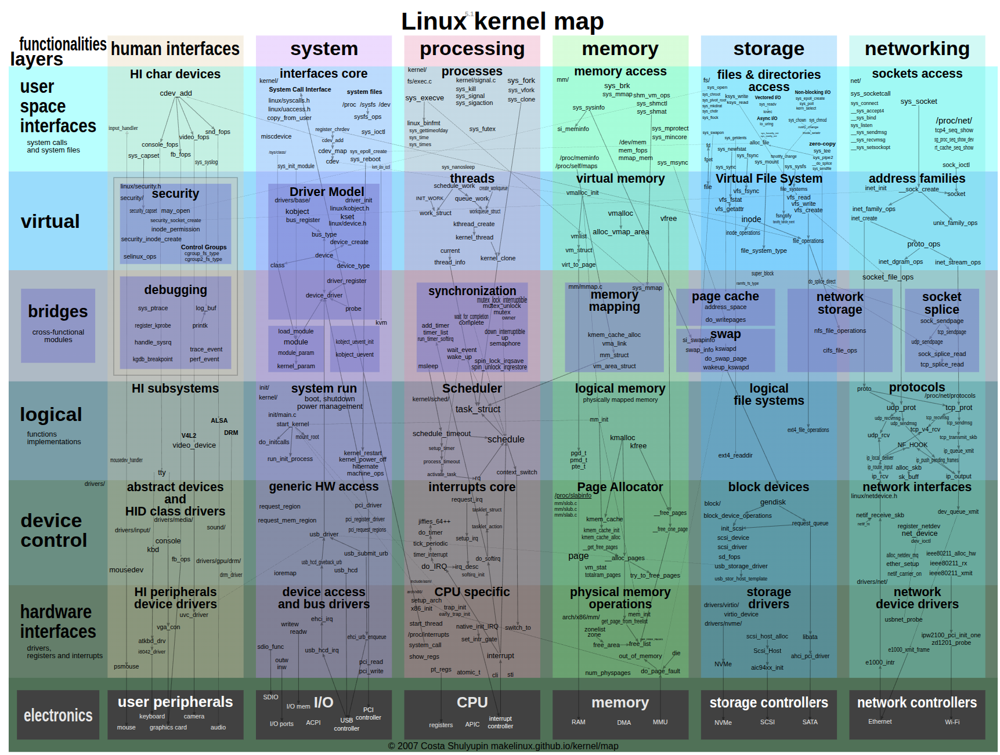
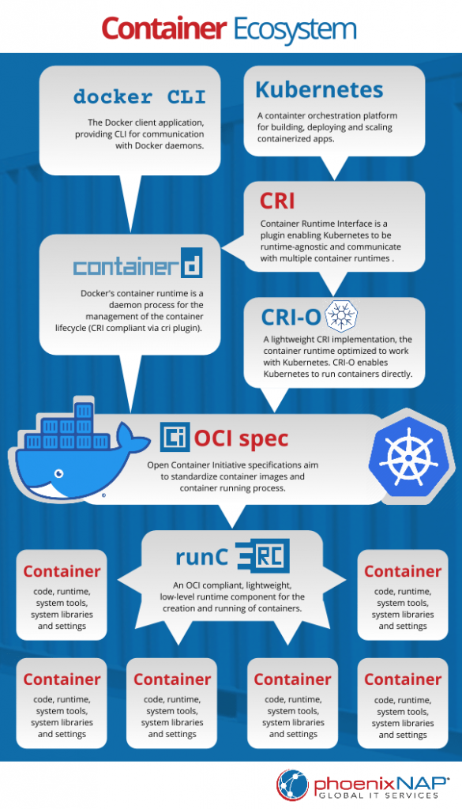
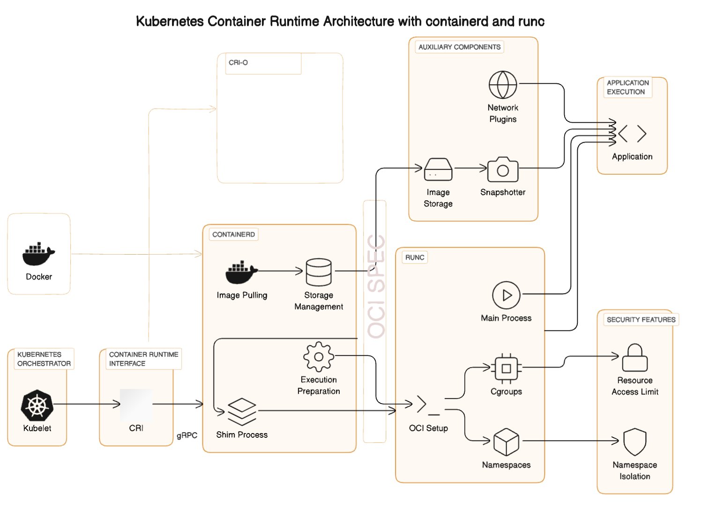
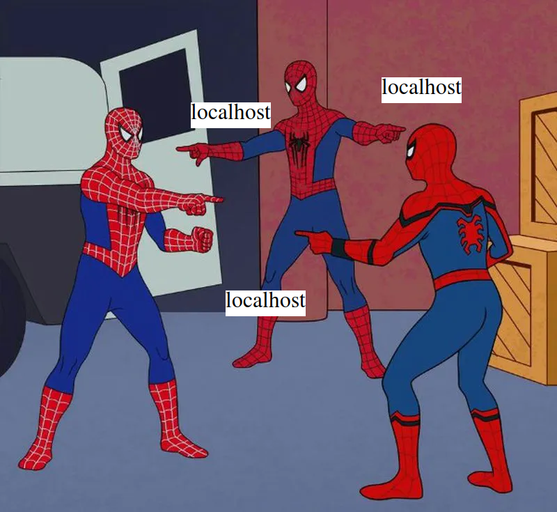
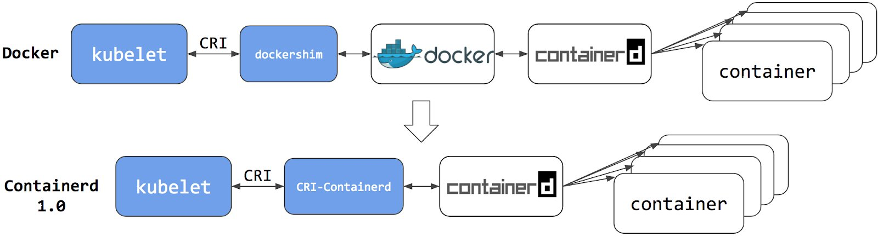
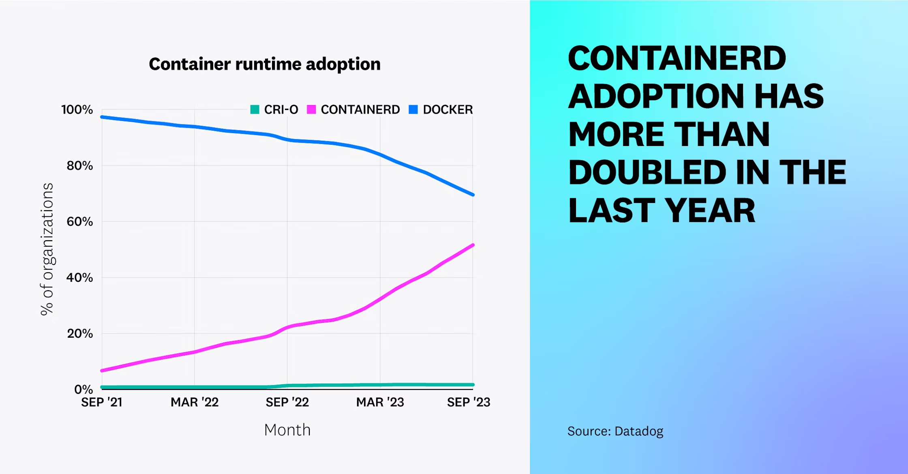
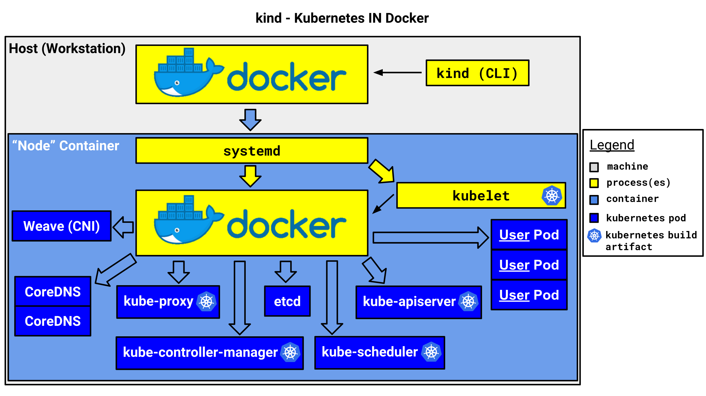

[comment]: # (Set the theme:)

[comment]: # (THEME = black)

[comment]: # (CODE_THEME = base16/zenburn)

[comment]: # (The list of themes is at https://revealjs.com/themes/)

[comment]: # (The list of code themes is at https://highlightjs.org/)

[comment]: # (Pass optional settings to reveal.js:)

[comment]: # (controls: true)

[comment]: # (keyboard: true)

[comment]: # (markdown: { smartypants: true })

[comment]: # (hash: false)

[comment]: # (respondToHashChanges: false)

[comment]: # (Other settings are documented at https://revealjs.com/config/)

Rasmus | 27.11.2025

# Local k8s

[comment]: # (!!!)

## Bring your own tools

* Any terminal
* bash || zsh
* git
* containerd

[comment]: # (!!!)

## Install the rest

```shell
curl -fsSL https://get.jetify.com/devbox | bash
git clone https://github.com/RasmusSoot/local-k8s.git
cd local-k8s
devbox shell
devbox run just-work
```

[comment]: # (!!!)

## Didn't work?

Docker is like an onion, peel away the layers and all you're left with is tears

[comment]: # (|||)

[What is a Linux Namespace and Container Isolation?](https://bunny.net/academy/computing/what-is-a-linux-namespace-and-container-isolation/)

 <!-- .element: style="height:50vh; max-width:80vw; image-rendering: crisp-edges;" -->
[comment]: # (||| data-background-color="white")

[From Linux Primitives to Kubernetes Security Contexts](https://learnkube.com/security-contexts)

[comment]: # (|||)

[Kernel map](https://makelinux.github.io/kernel/map/)

 <!-- .element: style="height:50vh; max-width:80vw; image-rendering: crisp-edges;" -->

[comment]: # (|||)

[Docker vs containerd vs CRI-O](https://phoenixnap.com/kb/docker-vs-containerd-vs-cri-o)

 <!-- .element: style="height:50vh; max-width:80vw; image-rendering: crisp-edges;" -->

[comment]: # (|||)

[CRI, Containerd and Runc Explained](https://devoriales.com/post/318/understanding-kubernetes-container-runtime-cri-containerd-and-runc-explained)

 <!-- .element: style="height:50vh; max-width:80vw; image-rendering: crisp-edges;" -->

[comment]: # (|||)

## Windows

* Docker Desktop
* Rancher Desktop
* Podman Desktop
* WSL2 Ubuntu + apt install -y docker
* [lima](https://github.com/lima-vm/lima) for Mac

[comment]: # (|||)

# Podman

```shell
podman save -o slides.tar slides:local
kind load image-archive slides.tar
```

[comment]: # (|||)

## Localhost on Windows

Host, devbox WSL, Docker WSL

 <!-- .element: style="height:50vh; max-width:80vw; image-rendering: crisp-edges;" -->

[comment]: # (!!!)

[containerd on Amazon EKS](https://aws.amazon.com/blogs/containers/all-you-need-to-know-about-moving-to-containerd-on-amazon-eks/)



[comment]: # (!!!)

 <!-- .element: style="height:50vh; max-width:80vw; image-rendering: crisp-edges;" -->

[comment]: # (!!!)

## containerd in containerd

* [kind](https://kind.sigs.k8s.io/) supports containerd
* [k3d](https://www.suse.com/c/rancher_blog/introduction-to-k3d-run-k3s-in-docker/) is the fastest
* [vCluster](https://www.vcluster.com/guides/tenancy-models-with-vcluster#how-it-works-8) for "production"

[comment]: # (!!!)

[Kubernetes IN Docker initial design](https://kind.sigs.k8s.io/docs/design/initial/)

 <!-- .element: style="height:50vh; max-width:80vw; image-rendering: crisp-edges;" -->

[comment]: # (!!!)

## What does this have to do with testing?

Local environment is now CI environment

* [kind interation test](https://gitlab.com/gitlab-org/charts/gitlab-runner/-/blob/main/.gitlab-ci.yml?ref_type=heads#L94)
* [devbox test](https://github.com/vfarcic/crossplane-sql/blob/devbox/.github/workflows/build.yaml#L25)
* P.S. Testcontainers requires Docker API - [kubedock](https://github.com/joyrex2001/kubedock)

[comment]: # (!!!)

## Alternatives

* Buy a Mac
* Build your own cloud
    * [Proxmox VE](https://www.proxmox.com/en/products/proxmox-virtual-environment/overview)/[Talos](https://docs.siderolabs.com/talos/v1.11/overview/what-is-talos)/[Harvester](https://harvesterhci.io/)
    * [X99 motherboard combo](https://www.aliexpress.com/w/wholesale-x99-motherboard-combo.html)
* Cough up 5€ a month for [Managed Kubernetes](https://www.civo.com/kubernetes)
* Keep using [docker compose](https://github.com/e-gov/GovSSO-Session/blob/master/docker-compose.yml)

[comment]: # (|||)

## Alternative cluster

* Personal vCluster inside your shared dev cluster
* Personal namespaces inside your shared dev cluster
* Single pod on your laptop running inside shared dev
  cluster - [tilt](https://tilt.dev), [telepresence](https://telepresence.io),
  [garden](https://garden.io), [skaffold](https://skaffold.dev), [devspace](https://devspace.sh), [mirrord](https://metalbear.com/mirrord)
* Personal database inside shared dev cluster - [postgres-branching](https://xata.io/postgres-branching)
* Give up and use shared dev cluster
